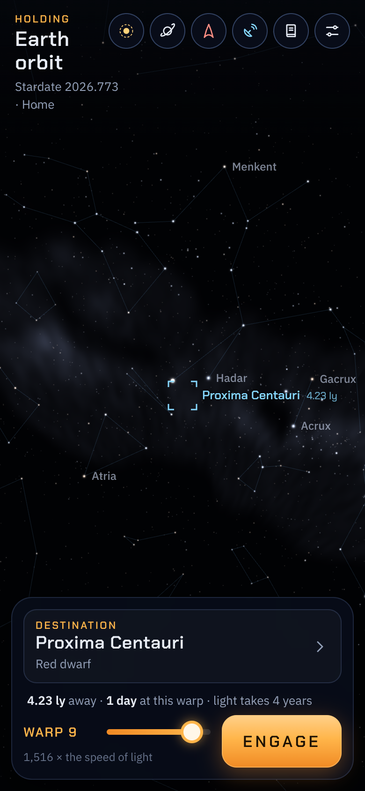
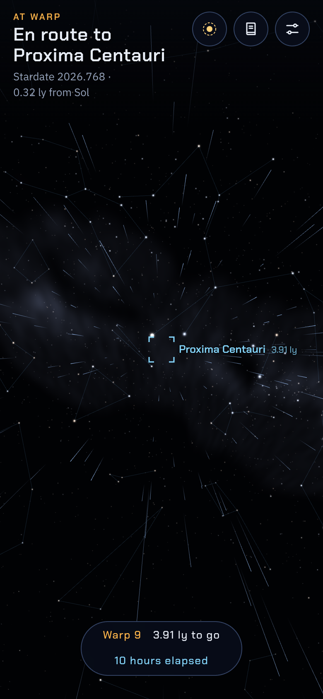
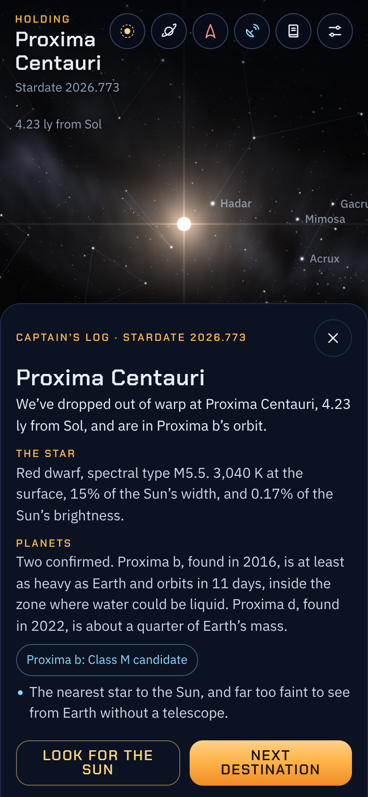
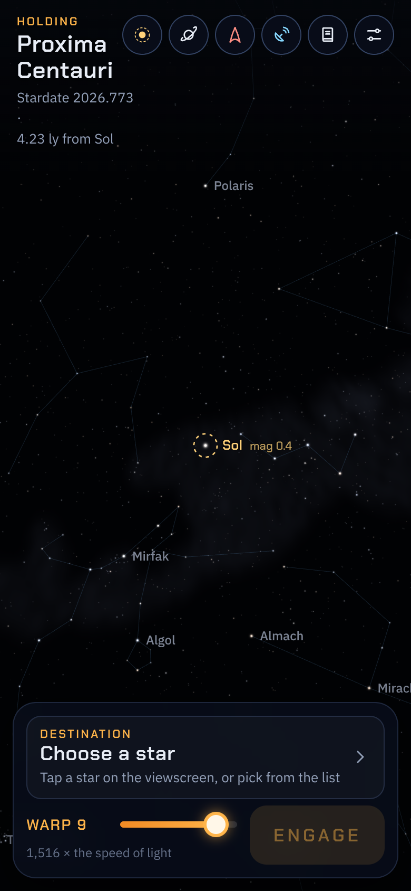
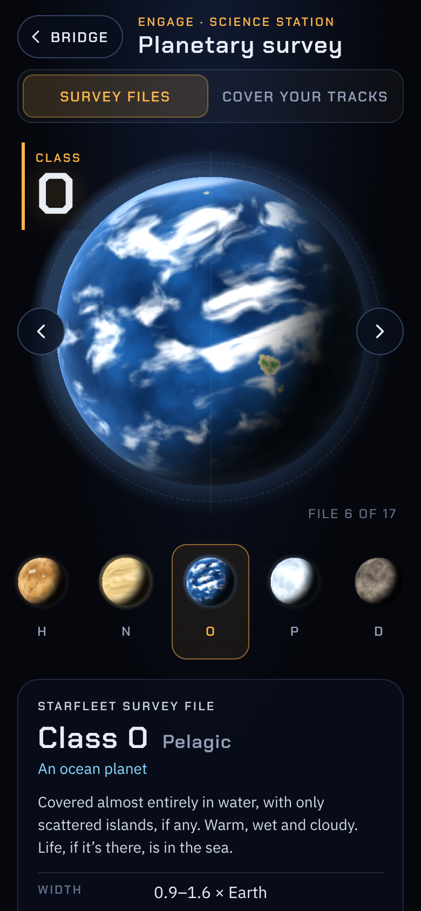
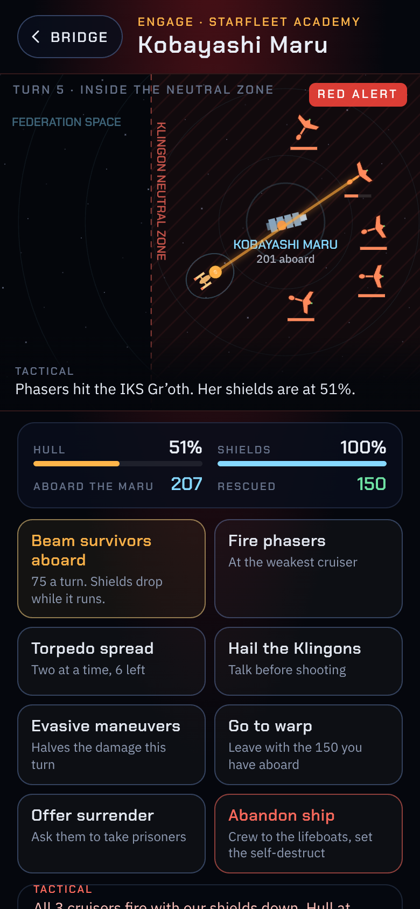
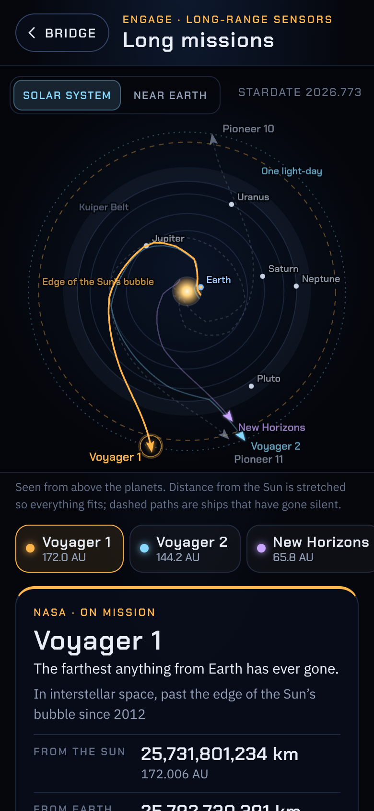
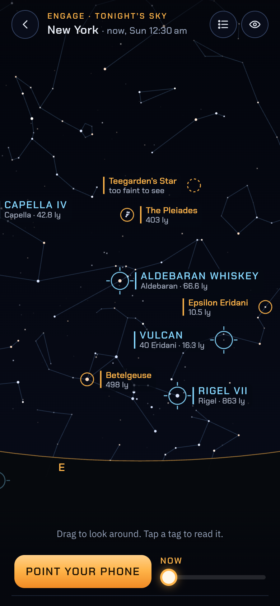

# Engage

**Use it: [junkdrawer.works/engage](https://junkdrawer.works/engage/)**

**Take the helm of a starship and warp to real stars.** Pick a destination, set a warp factor, and engage. The sky on the viewscreen is drawn from a real star catalogue, so as you travel, nearby stars slide past and constellations come apart the way they really would. When you drop out of warp, the captain’s log tells you what you’ve found, including where our Sun now sits in that sky.

<p align="center">
  
  &nbsp;
  
  &nbsp;
  
  &nbsp;
  
  &nbsp;
  
  &nbsp;
  
  &nbsp;
  
  &nbsp;
  
</p>

## How it works

- **Every star is real.** About 18,000 of them, from the HYG database: everything you can see from Earth with your eyes, plus every catalogued star within 80 light years. Each is drawn at its true position and as bright as it would look from wherever the ship is.
- **Set course.** Tap a star on the viewscreen, or choose from 32 destinations with notes (Proxima Centauri, TRAPPIST-1, Vulcan’s sun 40 Eridani, Betelgeuse…) or search the whole catalogue.
- **Warp factor.** Warp 1 is light speed and warp 9 is about 1,516 times it. The helm shows how long the trip would take, next to how long light needs. The flight itself is shortened to a few seconds.
- **Drop out of warp.** The ship holds where the star’s disc looks about two and a half degrees wide, or in the orbit of a known planet. The log covers the star, its planets, a few notes, how the Sun looks from there, which year of Earth’s history its light is showing, and when Earth’s first TV broadcasts arrive.
- **Look for the Sun.** The ☉ button turns the view toward home, marked even when it’s too faint to see.
- **Drag to look around, pinch or scroll to zoom.** Arrow keys work too.
- **The planetary survey** ([survey.html](https://junkdrawer.works/engage/survey.html), the ringed planet on the bridge) flips through Starfleet’s planet classes, from Class M to Demon class, next to the kinds astronomers have really found that Starfleet never named: super-Earths, sub-Neptunes, lava worlds, hot Jupiters and ice giants. Each file has typical readings, the Solar System’s examples, and real planets that fit, with **Set course** to fly there. The log links back to the files for the planets it mentions. **Cover your tracks** shows an unlogged world’s sensor readings and asks which file it would pass for.
- **The Kobayashi Maru** ([maru.html](https://junkdrawer.works/engage/maru.html), the Starfleet delta on the bridge) is the Academy’s no-win test. The fuel carrier *Kobayashi Maru* is adrift inside the Klingon Neutral Zone with 381 aboard. Give one order a turn: hail, cross the line, beam survivors over (your shields drop while the transporter runs), fire, evade, go to warp, offer surrender or abandon ship. The simulation is rigged the way the Academy rigs it: the Maru is always lost and the cruisers keep coming. At the end the examiners grade how you lost on compassion, judgment, restraint and nerve, and your record stays on the briefing. After your first run you can reprogram the simulator, as one cadet did.
- **Long missions** ([missions.html](https://junkdrawer.works/engage/missions.html), the dish on the bridge) tracks the real ships on the longest missions: Voyager 1 and 2, New Horizons, the James Webb Space Telescope, and the silent Pioneer 10 and 11. Their positions are worked out for this moment from NASA JPL Horizons trajectories, so the distances tick up as you watch. Each file has how far she is from the Sun and from Earth, her speed, how long a signal takes, the mission so far, what she’s doing now and where she’s bound, with **Set course** for the star she’ll pass. **Hail her** sends a message at the speed of light and shows when it arrives and when an answer could get back; it remembers the hail, so you can come back tomorrow to see it land. Webb gets a near-Earth view of her loop around L2.
- **Tonight’s sky** ([tonight.html](https://junkdrawer.works/engage/tonight.html), the horizon on the bridge) shows the real sky from where you’re standing, with the stars Starfleet knows tagged on it: Vulcan at 40 Eridani, Farpoint at Deneb, Rigel VII, the Vega colony, Wolf 359 and more, plus every other star Engage has notes on. **Point your phone** and it follows your compass and tilt, so you can hold it up to the real sky; drag sideways if the compass is a little off. Without sensors, drag to look around. Tags say when a star is too faint for your sky (city, suburbs or dark) or below the horizon, and the Moon and naked-eye planets are drawn too. Tap a tag for the story, where to look and how old its light is, then **Set course** to fly there. The time slider runs to 12 hours ahead, and in daylight it offers the evening. It uses your location only if you share it, rounded to about 10 km and kept on your phone; otherwise it guesses from your time zone or you pick a city. Night vision turns everything red to keep your eyes dark-adapted.
- No account and no server. The log and where you are stay in your browser. It works offline and installs to a phone’s home screen.

## Running it

It’s a static site: plain HTML, CSS and JavaScript, with no build step.

```sh
npx serve .                   # or any static file server, then open the printed address
npm test                      # checks the numbers, the Kobayashi Maru's rules, the ships' positions and the sky overlay's astronomy, then flies it in Chromium through the real page (needs Playwright)
node tools/screenshots.mjs    # redraws docs/*.png, og.png, og-survey.png, og-maru.png, og-missions.png and og-tonight.png (add `survey`, `maru`, `missions` or `tonight` for only that one's)
node tools/build-artifact.mjs # single-file copies for the Artifact viewer, in dist/
node tools/make-icons.mjs     # redraws the PNG icons from icon.svg
python3 tools/build-data.py HYG_CSV D3_CELESTIAL_DATA   # rebuilds data/ and img/milkyway.png (see the script)
```

To put it online with GitHub Pages: **Settings → Pages → Build and deployment → Deploy from a branch**, then pick `main` and `/ (root)`.

### Files

- `js/app.js`: the bridge: helm, flight, looking around, the log and settings.
- `js/sky.js`: the viewscreen in WebGL: stars, constellation lines, the Milky Way, star discs and warp streaks.
- `js/physics.js`: warp speeds, brightness, colour and size of stars, trip times. Pure functions.
- `js/log.js`: writes each captain’s log entry.
- `js/destinations.js`: the 32 stars with notes, and the moments in Earth’s history the log can mention.
- `js/catalog.js`: loads the stars and names where a direction points in the sky.
- `js/audio.js`: engine sounds, made with Web Audio.
- `survey.html`, `css/survey.css`, `js/survey.js`: the planetary survey.
- `js/classes.js`: the survey files: each class, its readings, and the real planets that fit it.
- `maru.html`, `css/maru.css`, `js/maru.js`: the Kobayashi Maru: the tactical display, each turn played out, the evaluation and the record.
- `js/maru-sim.js`: the Kobayashi Maru's rules and grading, with no page, so `test/maru.test.mjs` can check them.
- `missions.html`, `css/missions.css`, `js/missions.js`: long missions: the map, the ship files and hailing.
- `js/ephemeris.js`: where the ships and planets are at any moment. Probe positions and velocities on 1 January of each year 2020–2040, and coarser tracks from launch, are from [NASA JPL Horizons](https://ssd.jpl.nasa.gov/horizons/); Webb’s loop around L2 is Horizons every 10 days through 2027, then the L2 point itself. The planets (Mercury to Pluto) use JPL’s approximate orbital elements. Pure functions, checked by `test/missions.test.mjs`.
- `js/ships.js`: each ship’s file: what she has done, what she’s doing now, and where she’s bound.
- `tonight.html`, `css/tonight.css`, `js/tonight.js`: tonight’s sky: the view, the phone’s sensors, the tags, the card and where you are.
- `js/astro.js`: the local sky: sidereal time, how high and which way, the Sun, Moon and planets, how faint you can see, and the phone’s pose from its sensors. Pure functions, checked by `test/tonight.test.mjs`.
- `js/charts.js`: what Star Trek put at the stars you can see, and where each story is from.
- `js/planet-art.js`: paints each kind of planet from 3D noise and turns it as a lit globe on a 2D canvas.
- `data/stars.bin`, `data/stars.json`, `img/milkyway.png`: made by `tools/build-data.py` from the [HYG database](https://github.com/astronexus/HYG-Database) v4.1 by David Nash (CC BY-SA 4.0; this derived data is shared under the same licence) and [d3-celestial](https://github.com/ofrohn/d3-celestial) by Olaf Frohn (BSD 3-clause) for constellation lines, boundaries and the Milky Way.
- `fonts/`: Chakra Petch and IBM Plex Sans (SIL Open Font License), served from here so nothing loads from elsewhere.
- `sw.js`: keeps a copy for using offline.
